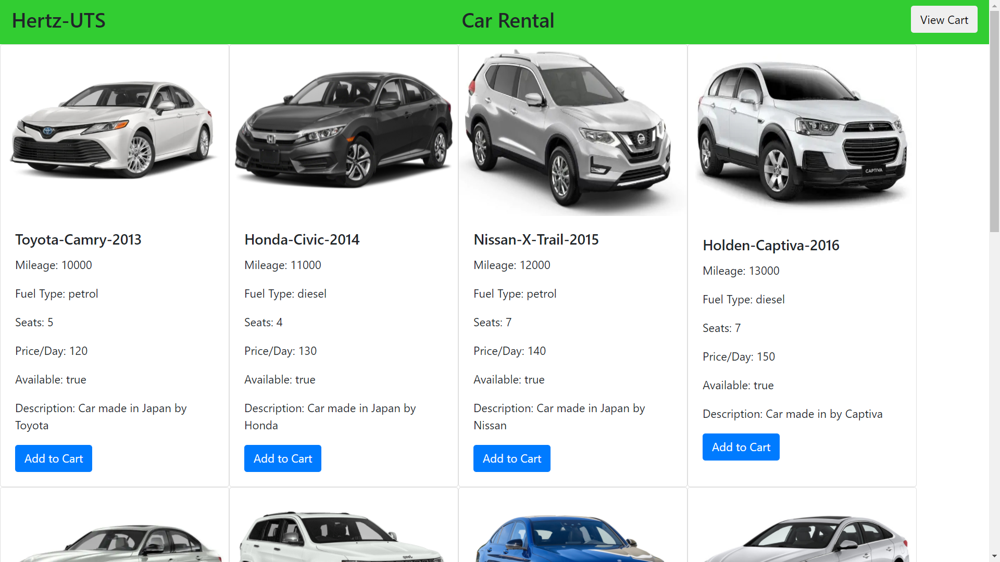

<h1 align="center"><a href="https://ormux.github.io/31748-POI-Car-Rental">31748 Car Rental Project</a></h1>
<h5 align="center">21/05/2021</h5>

<h6 align="center">click the title to view the website</h6>

<h4 align="center">technologies used</h4>

   
   
   
   

